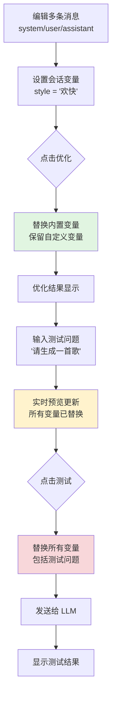

# 📱 上下文模式重构 - UI 设计分析报告

> **文档版本**: v2.0  
> **创建日期**: 2025-10-21  
> **最后更新**: 2025-10-22  
> **分析范围**: 上下文模式 (User/System) UI 组件设计 + 变量系统重构  
> **状态**: ✅ v1.1改造已完成，📋 v2.0变量系统重构待实施

---

## 📢 重要更新

### ✅ v1.1 UI改造 (已完成 - 2025-10-22)

1. **子模式选择器位置调整** ✅ 已完成
   - **问题**: 子模式选择器位于工作区内，层级混乱
   - **方案**: 移动到导航栏，紧邻功能模式选择器右侧
   - **状态**: ✅ 已完成
   - **提交**: 之前已完成

2. **快捷操作栏位置调整** ✅ 已完成
   - **问题**: 快捷操作栏在左侧优化区，作用域不明确
   - **方案**: 移动到右侧测试区顶部，贴近使用场景
   - **状态**: ✅ 已完成
   - **提交**: `ce90d47` - refactor(ui): 优化上下文模式快捷操作栏位置

### 📋 v2.0 变量系统重构 (待实施)

3. **变量系统简化** 🔴 高优先级
   - **问题**: "全局变量"和"会话变量"概念混淆，实际都是持久化变量
   - **方案**: 移除会话变量，引入测试区临时变量
   - **状态**: ✅ 已完成（作为归档记录）
   - **详情**: 见 [变量系统重构设计文档](./design.md)

### 📊 改造预期效果

**改造前:**
```
┌────────────────────────────────────────────────────────┐
│ Prompt Optimizer | [基础|上下文|图像] | 📝📜⚙️...     │
├────────────────────────┬───────────────────────────────┤
│ [📊📝🔧]              │ 测试区                         │
│ ──────────────────────  │                               │
│ [系统|用户] [模型▾]    │                               │
│ 输入框...              │                               │
└────────────────────────┴───────────────────────────────┘
      ↑ 问题1: 层级混乱         ↑ 问题2: 操作距离远
```

**改造后:**
```
┌────────────────────────────────────────────────────────┐
│ Prompt Optimizer                                       │
│ [基础|上下文|图像] [系统|用户] 📝📜⚙️...              │
│    ↑ 功能模式           ↑ 子模式（动态显示）           │
├────────────────────────┬───────────────────────────────┤
│ 优化区                 │ 测试区                         │
│                        │ ┌───────────────────────────┐ │
│ [模型▾] [模板▾]       │ │ 测试 📊全局 📝会话 🔧工具 │ │
│ 输入框...              │ └───────────────────────────┘ │
│ (空间增加)             │ 变量输入...                   │
└────────────────────────┴───────────────────────────────┘
```

**改进效果:**
- ✅ 层级清晰：功能模式和子模式在同一导航栏
- ✅ 作用域明确：快捷操作栏在测试区，贴近使用场景
- ✅ 空间优化：优化区垂直空间增加
- ✅ 操作便捷：测试时设置变量，操作路径最短

---

## 一、整体架构设计

### 1.1 组件层次结构

```
App.vue (主应用)
├── ContextUserWorkspace.vue (用户模式工作区)
│   ├── ContextModeActions (快捷操作按钮)
│   ├── InputPanelUI (提示词输入)
│   ├── PromptPanelUI (优化结果)
│   └── TestAreaPanel (测试区域)
│
└── ContextSystemWorkspace.vue (系统模式工作区)
    ├── ContextModeActions (快捷操作按钮)
    ├── InputPanelUI (提示词输入)
    ├── ConversationManager (会话管理器) ← 系统模式专属
    ├── PromptPanelUI (优化结果)
    └── TestAreaPanel (测试区域)

共享组件:
├── ContextEditor.vue (上下文编辑器 - 模态框)
├── PromptPreviewPanel.vue (预览面板 - 模态框)
└── TestAreaPanel.vue (测试区域 - 复用)
```

**组件文件位置:**
```
packages/ui/src/components/
├── context-mode/
│   ├── ContextUserWorkspace.vue
│   ├── ContextSystemWorkspace.vue
│   ├── ContextModeActions.vue
│   ├── ContextEditor.vue
│   └── ConversationManager.vue
├── PromptPreviewPanel.vue
├── TestAreaPanel.vue
├── InputPanel.vue
└── PromptPanel.vue

packages/ui/src/composables/
└── usePromptPreview.ts
```

### 1.2 设计模式

✅ **采用了优秀的设计模式:**

1. **组合优于继承**
   - User/System Workspace 是独立组件而非继承
   - 避免了复杂的 if-else 条件判断

2. **Props 单向数据流**
   - 所有数据通过 props 传入
   - 通过 emit 触发父组件更新
   - 遵循 Vue 3 最佳实践

3. **Composable 逻辑复用**
   - `usePromptPreview` 提供可复用的预览逻辑
   - 分离 UI 和业务逻辑

4. **Slot 插槽扩展**
   - 模型选择、结果显示等使用插槽实现灵活性
   - 支持不同场景的自定义渲染

---

## 二、两种模式的 UI 差异

### 2.1 用户模式 (User Mode)

**文件**: `packages/ui/src/components/context-mode/ContextUserWorkspace.vue`

**布局结构:**
```
┌──────────────────────────────────────────────────────┐
│ 📊 全局变量  📝 会话变量  🔧 工具管理               │ ← 快捷操作
├──────────────────────────────────────────────────────┤
│ 左侧优化区                │ 右侧测试区              │
│ ┌─────────────────────┐  │ ┌──────────────────────┐│
│ │ 提示词输入面板       │  │ │ 变量值输入表单       ││
│ │ "写一首{{style}}的歌"│  │ │ style: [欢快____]   ││
│ └─────────────────────┘  │ └──────────────────────┘│
│ ┌─────────────────────┐  │ ┌──────────────────────┐│
│ │ 优化结果面板         │  │ │ 预览内容             ││
│ │ "请创作一首风格为    │  │ │ "请创作一首风格为    ││
│ │  {{style}}的歌..."  │  │ │  欢快的歌..."       ││
│ └─────────────────────┘  │ └──────────────────────┘│
│                          │ ┌──────────────────────┐│
│                          │ │ 测试结果             ││
│                          │ │ (LLM 响应)          ││
│                          │ └──────────────────────┘│
└──────────────────────────────────────────────────────┘
```

**核心特点:**
- ❌ **隐藏** 会话消息列表管理
- ✅ **显示** 工具管理按钮
- ✅ 单条用户消息优化
- ✅ 两阶段变量处理（优化保留 → 测试替换）
- ✅ 无需输入测试问题（提示词即测试内容）

**代码特征:**
```vue
<!-- 用户模式工作区核心结构 -->
<template>
  <NFlex justify="space-between">
    <!-- 左侧优化区 -->
    <NFlex vertical>
      <!-- 快捷操作 (包含工具管理按钮) -->
      <NCard>
        <NButton @click="emit('open-global-variables')">📊</NButton>
        <NButton @click="emit('open-context-variables')">📝</NButton>
        <NButton @click="emit('open-tool-manager')">🔧</NButton>
      </NCard>
      
      <!-- 提示词输入 -->
      <NCard><InputPanelUI /></NCard>
      
      <!-- 无会话管理器 -->
      
      <!-- 优化结果 -->
      <NCard><PromptPanelUI /></NCard>
    </NFlex>
    
    <!-- 右侧测试区 -->
    <NCard>
      <TestAreaPanel 
        context-mode="user"
        :optimized-prompt="optimizedPrompt"
        :global-variables="globalVariables"
        :context-variables="contextVariables" />
    </NCard>
  </NFlex>
</template>
```

### 2.2 系统模式 (System Mode)

**文件**: `packages/ui/src/components/context-mode/ContextSystemWorkspace.vue`

**布局结构:**
```
┌──────────────────────────────────────────────────────┐
│ 📊 全局变量  📝 会话变量                             │ ← 快捷操作
├──────────────────────────────────────────────────────┤
│ 左侧优化区                │ 右侧测试区              │
│ ┌─────────────────────┐  │ ┌──────────────────────┐│
│ │ 提示词输入面板       │  │ │ 变量值输入表单       ││
│ │ "优化以下对话..."   │  │ │ style: [欢快____]   ││
│ └─────────────────────┘  │ └──────────────────────┘│
│ ┌─────────────────────┐  │ ┌──────────────────────┐│
│ │ 会话管理器 [折叠]   │  │ │ 测试输入 (用户问题) ││
│ │ • system: 你是...   │  │ │ "请生成一首欢快的歌" ││
│ │ • user: {{style}}   │  │ └──────────────────────┘│
│ │ • assistant: ...    │  │ ┌──────────────────────┐│
│ │ [打开上下文编辑器]  │  │ │ 预览内容             ││
│ └─────────────────────┘  │ │ system: 你是歌曲创作 ││
│ ┌─────────────────────┐  │ │ user: 欢快          ││
│ │ 优化结果面板         │  │ └──────────────────────┘│
│ │ (优化后的对话上下文) │  │ ┌──────────────────────┐│
│ └─────────────────────┘  │ │ 测试结果             ││
│                          │ │ (LLM 响应)          ││
│                          │ └──────────────────────┘│
└──────────────────────────────────────────────────────┘
```

**核心特点:**
- ✅ **显示** 会话消息管理器（可折叠）
- ❌ **隐藏** 工具管理按钮（系统模式不直接管理工具）
- ✅ 多消息上下文编辑
- ✅ 需要额外的测试输入 (`userQuestion`)
- ✅ 支持 system/user/assistant/tool 多种角色

**代码特征:**
```vue
<!-- 系统模式工作区核心结构 -->
<template>
  <NFlex justify="space-between">
    <!-- 左侧优化区 -->
    <NFlex vertical>
      <!-- 快捷操作 (无工具管理按钮) -->
      <NCard>
        <NButton @click="emit('open-global-variables')">📊</NButton>
        <NButton @click="emit('open-context-variables')">📝</NButton>
      </NCard>
      
      <!-- 提示词输入 -->
      <NCard><InputPanelUI /></NCard>
      
      <!-- 会话管理器 (系统模式专属) -->
      <NCard>
        <ConversationManager
          :messages="optimizationContext"
          context-mode="system"
          @update:messages="emit('update:optimizationContext', $event)" />
      </NCard>
      
      <!-- 优化结果 -->
      <NCard><PromptPanelUI /></NCard>
    </NFlex>
    
    <!-- 右侧测试区 -->
    <NCard>
      <TestAreaPanel 
        context-mode="system"
        :test-content="testContent"
        :optimized-prompt="optimizedPrompt" />
    </NCard>
  </NFlex>
</template>
```

---

## 三、关键组件深度分析

### 3.1 `ContextModeActions.vue` - 快捷操作栏

**文件**: `packages/ui/src/components/context-mode/ContextModeActions.vue`

**设计亮点:**
```vue
<template>
  <NFlex align="center" :wrap="false" :size="12">
    <!-- 全局变量 - 两种模式都显示 -->
    <NButton
      size="small"
      type="default"
      @click="$emit('open-global-variables')"
      :title="$t('contextMode.actions.globalVariables')"
    >
      <template #icon><span>📊</span></template>
      {{ $t('contextMode.actions.globalVariables') }}
    </NButton>

    <!-- 会话变量 - 两种模式都显示 -->
    <NButton
      size="small"
      @click="$emit('open-context-variables')"
    >
      <template #icon><span>📝</span></template>
      {{ $t('contextMode.actions.contextVariables') }}
    </NButton>

    <!-- 工具管理 - 仅用户模式显示 -->
    <NButton
      v-if="contextMode === 'user'"
      size="small"
      @click="$emit('open-tool-manager')"
    >
      <template #icon><span>🔧</span></template>
      {{ $t('contextMode.actions.tools') }}
    </NButton>
  </NFlex>
</template>

<script setup lang="ts">
import type { ContextMode } from '@prompt-optimizer/core'

defineProps<{
  contextMode: ContextMode
}>()

defineEmits<{
  'open-global-variables': []
  'open-context-variables': []
  'open-tool-manager': []
}>()
</script>
```

**优点:**
- ✅ 简洁的条件渲染 (`v-if="contextMode === 'user'"`)
- ✅ 语义化的 emoji 图标
- ✅ 国际化支持 (`$t()`)
- ✅ 类型安全的 emit 定义

**⚠️ 当前问题:**

**问题**: 设计文档中提到"工具管理 - 两种模式都显示"，但实际代码是 `v-if="contextMode === 'user'"`

**影响**: 系统模式无法管理工具（如果需要的话）

**建议**: 
1. 统一设计文档和实现，明确系统模式是否需要工具管理
2. 如果系统模式也需要，移除 `v-if` 条件
3. 如果确实只有用户模式需要，更新设计文档

---

### 3.2 `ConversationManager.vue` - 会话管理器

**文件**: `packages/ui/src/components/context-mode/ConversationManager.vue`

**设计亮点:**

#### 1️⃣ **性能优化**
```typescript
// 使用防抖减少频繁更新
const handleMessageUpdate = debounce(
  (index: number, message: ConversationMessage) => {
    const newMessages = [...props.messages];
    newMessages[index] = message;
    emit('update:messages', newMessages);
    emit('messageChange', index, message, 'update');
    recordUpdate();
  },
  150 // 150ms 平衡响应性和性能
);

// 批处理状态更新
const batchStateUpdate = batchExecute((updates: Array<() => void>) => {
  updates.forEach((update) => update());
  recordUpdate();
}, 16); // 16ms 匹配 60fps
```

#### 2️⃣ **模式化行为**
```typescript
const canEditMessages = computed(() => {
  // readonly 优先级最高
  if (props.readonly) return false;
  
  // 用户模式不允许编辑消息
  if (props.contextMode === 'user') return false;
  
  // 系统模式允许编辑
  return true;
});
```

#### 3️⃣ **紧凑布局设计**
```vue
<div class="cm-row">
  <!-- 角色标签 (小号，下拉选择) -->
  <NDropdown :options="roleOptions" @select="handleRoleSelect">
    <NTag :size="tagSize" clickable>
      {{ $t(`conversation.roles.${message.role}`) }}
    </NTag>
  </NDropdown>

  <!-- 内容输入，单行自增高 -->
  <div class="content">
    <NInput
      v-model="message.content"
      type="textarea"
      :autosize="{ minRows: 1, maxRows: 1 }"
      :resizable="false"
    />
  </div>

  <!-- 操作按钮 (hover 显示) -->
  <NSpace class="actions">
    <NButton @click="moveUp" quaternary circle />
    <NButton @click="moveDown" quaternary circle />
    <NButton @click="delete" quaternary circle type="error" />
  </NSpace>
</div>

<style scoped>
.cm-row {
  display: flex;
  align-items: center;
  gap: 8px;
  flex-wrap: nowrap;
}

.cm-row .actions {
  opacity: 0.6;
  transition: opacity 0.15s ease;
}

.cm-row:hover .actions {
  opacity: 1; /* Hover 时显示操作按钮 */
}

.cm-row .content {
  flex: 1 1 auto;
  min-width: 0;
}
</style>
```

**优点:**
- ✅ 单行布局节省空间
- ✅ Hover 显示操作按钮减少视觉噪音
- ✅ 下拉菜单添加消息支持多种角色 (system/user/assistant/tool)
- ✅ 性能优化到位（防抖 + 批处理）

**⚠️ 潜在问题:**

**问题**: 单行输入限制 (`autosize: { minRows: 1, maxRows: 1 }`) 可能导致长文本难以编辑

**场景示例:**
```
当消息内容较长时:
system: "你是一个专业的歌曲创作助手，擅长创作各种风格的歌曲，包括流行、摇滚、民谣、说唱等..."
```

单行显示会导致:
- ❌ 内容被截断，需要横向滚动
- ❌ 难以看到完整上下文
- ❌ 编辑体验差

**改进建议:**

#### 方案 1: 展开/折叠功能
```vue
<script setup lang="ts">
const expandedRows = ref(new Set<number>());

const toggleExpand = (index: number) => {
  if (expandedRows.value.has(index)) {
    expandedRows.value.delete(index);
  } else {
    expandedRows.value.add(index);
  }
};
</script>

<template>
  <div class="cm-row" :class="{ 'expanded': expandedRows.has(index) }">
    <!-- 单行模式 -->
    <NInput
      v-if="!expandedRows.has(index)"
      :autosize="{ minRows: 1, maxRows: 1 }"
      @dblclick="toggleExpand(index)"
      placeholder="双击展开编辑"
    />
    
    <!-- 展开模式 -->
    <NInput
      v-else
      :autosize="{ minRows: 3, maxRows: 20 }"
      @blur="toggleExpand(index)"
    />
    
    <!-- 展开/折叠按钮 -->
    <NButton @click="toggleExpand(index)" quaternary circle>
      <template #icon>
        <svg v-if="!expandedRows.has(index)"><!-- 展开图标 --></svg>
        <svg v-else><!-- 折叠图标 --></svg>
      </template>
    </NButton>
  </div>
</template>
```

#### 方案 2: 直接跳转到完整编辑器
```vue
<NButton
  @click="emit('open-context-editor')"
  type="primary"
  :loading="loading"
>
  <template #icon>
    <svg><!-- 编辑图标 --></svg>
  </template>
  {{ $t('conversation.management.openEditor') }}
</NButton>
```

---

### 3.3 `PromptPreviewPanel.vue` - 实时预览面板

**文件**: `packages/ui/src/components/PromptPreviewPanel.vue`

**设计亮点:**

#### 1️⃣ **变量统计可视化**
```vue
<NCard size="small" :title="$t('contextMode.preview.stats')">
  <NFlex :size="12" :wrap="true">
    <NTag :bordered="false" type="info">
      {{ $t('contextMode.preview.totalVars') }}: {{ variableStats.total }}
    </NTag>
    <NTag :bordered="false" type="success">
      {{ $t('contextMode.preview.providedVars') }}: {{ variableStats.provided }}
    </NTag>
    <NTag v-if="variableStats.missing > 0" :bordered="false" type="warning">
      {{ $t('contextMode.preview.missingVars') }}: {{ variableStats.missing }}
    </NTag>
  </NFlex>
</NCard>
```

#### 2️⃣ **缺失变量高亮**
```vue
<NCard
  v-if="hasMissingVariables"
  size="small"
  :title="$t('contextMode.preview.missingVarsWarning')"
>
  <NFlex :size="8" :wrap="true">
    <NTag
      v-for="varName in missingVariables"
      :key="varName"
      type="warning"
      :bordered="false"
    >
      <span v-text="`{{${varName}}}`"></span>
    </NTag>
  </NFlex>
  <template #footer>
    <NText depth="3">
      {{ $t('contextMode.preview.missingVarsHint') }}
    </NText>
  </template>
</NCard>
```

#### 3️⃣ **模式说明动态提示**
```vue
<NCard size="small" :title="$t('contextMode.preview.modeExplanation')">
  <NText depth="2">
    <template v-if="contextMode === 'user' && renderPhase === 'optimize'">
      {{ $t('contextMode.preview.userOptimizeHint') }}
      <!-- "用户优化模式：变量将在优化时保留，测试时替换为实际值" -->
    </template>
    <template v-else-if="contextMode === 'system' && renderPhase === 'optimize'">
      {{ $t('contextMode.preview.systemOptimizeHint') }}
      <!-- "系统优化模式：内置变量替换，自定义变量保留" -->
    </template>
    <template v-else>
      {{ $t('contextMode.preview.testPhaseHint') }}
      <!-- "测试阶段：所有变量替换为实际值" -->
    </template>
  </NText>
</NCard>
```

**优点:**
- ✅ 信息层次清晰（统计 → 警告 → 内容 → 说明）
- ✅ 颜色语义化（info/success/warning）
- ✅ 教育用户理解两阶段处理
- ✅ 响应式布局 (`:wrap="true"`)

**💡 改进建议: 缺失变量快速操作**

**当前行为:**
```vue
<!-- 缺失变量仅显示，无法快速操作 -->
<NTag v-for="varName in missingVariables" :key="varName" type="warning">
  {{{{ varName }}}}
</NTag>
```

**改进后:**
```vue
<!-- 点击缺失变量快速创建/编辑 -->
<NTag
  v-for="varName in missingVariables"
  :key="varName"
  type="warning"
  clickable
  @click="handleQuickCreateVariable(varName)"
  :title="$t('contextMode.preview.clickToCreateVariable')"
>
  <span v-text="`{{${varName}}}`"></span>
</NTag>

<script setup lang="ts">
const emit = defineEmits<{
  'create-variable': [varName: string]
  'update:show': [value: boolean]
}>()

const handleQuickCreateVariable = (varName: string) => {
  // 方案1: 触发事件让父组件处理
  emit('create-variable', varName);
  
  // 方案2: 直接打开变量管理器并聚焦该变量
  // router.push({ name: 'variable-manager', query: { focus: varName } });
};
</script>
```

**用户体验提升:**
```
之前: 看到缺失变量 → 关闭预览 → 手动打开变量管理器 → 找到变量 → 编辑
现在: 看到缺失变量 → 点击 → 直接创建/编辑 ✅
```

---

### 3.4 `usePromptPreview.ts` - 预览逻辑

**文件**: `packages/ui/src/composables/usePromptPreview.ts`

**设计亮点:**

#### 1️⃣ **简化的变量替换**
```typescript
/**
 * 渲染后的预览内容
 *
 * 简化版本：统一使用简单替换逻辑
 * 注意：这里使用简单的正则替换而不是 Mustache，因为：
 * 1. UI 预览不需要 Mustache 的条件渲染等高级特性
 * 2. 简单替换性能更好，适合实时预览
 * 3. 与后端 Mustache 行为一致（都会保留值中的占位符）
 */
const previewContent = computed(() => {
  if (!content.value) return "";

  try {
    const vars = variables.value || {};

    // 统一的变量替换逻辑
    const result = content.value.replace(
      /\{\{([^{}]+)\}\}/g,
      (match, varName) => {
        const trimmedName = varName.trim();

        // 跳过 Mustache 特殊标签 (#, /, ^, !, >, &)
        if (
          trimmedName.startsWith("#") ||
          trimmedName.startsWith("/") ||
          trimmedName.startsWith("^") ||
          trimmedName.startsWith("!") ||
          trimmedName.startsWith(">") ||
          trimmedName.startsWith("&")
        ) {
          return match;
        }

        // 如果变量存在且非空，替换；否则保留占位符
        if (vars[trimmedName] !== undefined && vars[trimmedName] !== "") {
          return vars[trimmedName];
        }
        return match;
      }
    );

    return result;
  } catch (error) {
    console.error("[usePromptPreview] Preview rendering failed:", error);
    return content.value;
  }
});
```

#### 2️⃣ **变量统计**
```typescript
const variableStats = computed(() => ({
  total: parsedVariables.value.allVars.size,
  builtin: parsedVariables.value.builtinVars.size,
  custom: parsedVariables.value.customVars.size,
  missing: missingVariables.value.length,
  provided: parsedVariables.value.allVars.size - missingVariables.value.length,
}));
```

**优点:**
- ✅ 性能优于 Mustache（预览场景足够）
- ✅ 与后端行为一致（都保留值中的占位符）
- ✅ 跳过 Mustache 特殊标签
- ✅ 错误处理完善

**⚠️ 潜在问题:**

**问题**: 与后端 Mustache 可能存在不一致的风险

**场景**: 如果模板使用了 Mustache 的高级特性，预览可能不准确

```mustache
{{! 注释 }}
{{#if showTitle}}
  标题：{{title}}
{{/if}}

{{#each items}}
  - {{name}}: {{value}}
{{/each}}
```

当前简单正则替换无法处理:
- ❌ 条件渲染 (`{{#if}}...{{/if}}`)
- ❌ 循环渲染 (`{{#each}}...{{/each}}`)
- ❌ 部分渲染 (`{{>partial}}`)

**改进建议:**

#### 方案 1: 文档说明限制
```typescript
/**
 * 提示词预览 Composable
 *
 * 用于实时计算提示词渲染结果并检测缺失变量
 *
 * ⚠️ 限制说明:
 * - 使用简单正则替换，不支持 Mustache 高级特性
 * - 不支持条件渲染 ({{#if}})、循环 ({{#each}})、部分模板 ({{>}})
 * - 仅用于基本变量预览，最终渲染以后端为准
 * - 如需完整 Mustache 渲染，请使用后端 API
 */
```

#### 方案 2: 集成 Mustache.js
```typescript
import Mustache from 'mustache';

const previewContent = computed(() => {
  try {
    // 使用 Mustache 完整渲染
    return Mustache.render(content.value, variables.value);
  } catch (error) {
    // 降级到简单替换
    return content.value.replace(/\{\{([^{}]+)\}\}/g, ...);
  }
});
```

**权衡:**
- **方案 1**: 简单，但功能有限，需要用户理解限制
- **方案 2**: 功能完整，但增加依赖和复杂度

**建议**: 当前方案 1 足够，在文档中明确说明即可

---

## 四、UI 交互流程分析

### 4.1 用户模式完整流程

```mermaid
graph TD
    A[用户输入提示词<br/>'写一首{{style}}的歌'] --> B{点击优化}
    B --> C[AI 优化<br/>保留 {{style}} 占位符]
    C --> D[优化结果显示<br/>'请创作一首风格为{{style}}的歌...']
    D --> E[用户设置变量<br/>style = '欢快']
    E --> F[实时预览更新<br/>'请创作一首风格为欢快的歌...']
    F --> G{点击测试}
    G --> H[替换所有变量]
    H --> I[发送给 LLM]
    I --> J[显示测试结果]
    
    style C fill:#e1f5e1
    style F fill:#fff3cd
    style H fill:#f8d7da
```

**关键步骤说明:**

1. **优化阶段** (绿色) - 占位符保留
   - 用户输入: `"写一首{{style}}的歌"`
   - 发送给 AI: 包含 `{{style}}` 字面文本
   - AI 优化: 保留所有占位符
   - 优化结果: `"请创作一首风格为{{style}}的歌..."`

2. **预览阶段** (黄色) - 实时渲染
   - 用户设置: `style = "欢快"`
   - 预览显示: `"请创作一首风格为欢快的歌..."`
   - 变量统计: 总数 1, 已提供 1, 缺失 0

3. **测试阶段** (红色) - 完全替换
   - 合并三层变量 (全局 ← 会话 ← 内置)
   - 替换所有占位符
   - 发送给 LLM: 不包含任何 `{{}}`

### 4.2 系统模式完整流程



**关键步骤说明:**

1. **会话编辑** - 多消息管理
   - system: `"你是歌曲创作助手"`
   - user: `"创作{{style}}的歌"`
   - assistant: `"好的，我会创作..."`

2. **优化阶段** (绿色) - 分层替换
   - 替换内置变量: `{{originalPrompt}}`, `{{conversationContext}}`
   - 保留自定义变量: `{{style}}`

3. **测试阶段** (黄色 → 红色) - 完全渲染
   - 需要额外输入用户问题
   - 预览显示所有变量替换后的效果
   - 最终发送完全渲染的消息数组

---

## 五、UI 设计优势

### ✅ 做得好的地方

#### 1. **模式化组件设计**
- 清晰的 User/System Workspace 分离
- 组件根据 `contextMode` 智能调整行为
- 避免了复杂的 if-else 判断

**代码示例:**
```typescript
// ConversationManager.vue
const canEditMessages = computed(() => {
  if (props.contextMode === 'user') return false; // 用户模式禁止编辑
  return true; // 系统模式允许
});
```

#### 2. **Naive UI 一致性**
- 全面使用 Naive UI 组件 (NCard, NButton, NTag, NInput...)
- 统一的 size/type/bordered 配置
- 主题自适应 (dark/light mode)

**组件使用统计:**
```
NCard: 主容器
NButton: 所有按钮
NTag: 标签、统计、角色标识
NInput: 文本输入
NDropdown: 角色选择、消息添加
NScrollbar: 滚动区域
NEmpty: 空状态提示
```

#### 3. **响应式适配**
```typescript
// 响应式配置
const buttonSize = computed(() => {
  const sizeMap = { small: 'tiny', medium: 'small', large: 'medium' };
  return sizeMap[props.size] || 'small';
});

// 移动端适配
<NGrid :cols="isMobile ? 1 : 2" :x-gap="12" :y-gap="12">
```

#### 4. **性能优化**
- 防抖处理高频更新 (150ms)
- 批处理状态更新 (16ms)
- `shallowRef` 优化大数据
- 性能监控 (`usePerformanceMonitor`)

**性能优化代码:**
```typescript
// 防抖
const handleMessageUpdate = debounce((index, message) => {
  emit('update:messages', newMessages);
}, 150);

// 批处理
const batchStateUpdate = batchExecute((updates) => {
  updates.forEach(update => update());
}, 16);
```

#### 5. **可访问性 (a11y)**
- 完整的 `role` 属性 (dialog, button, list...)
- `aria-label`, `aria-describedby` 标注
- 键盘导航支持 (`@keydown.enter`, `@keydown.space`)
- `tabindex` 焦点管理

**可访问性代码:**
```vue
<NModal
  role="dialog"
  :aria-label="aria.getLabel('contextEditor')"
  :aria-describedby="aria.getDescription('contextEditor')"
  aria-modal="true"
>
  <NButton
    @click="addMessage"
    @keydown.enter="addMessage"
    @keydown.space.prevent="addMessage"
    :aria-label="aria.getLabel('addMessage')"
  />
</NModal>
```

#### 6. **国际化完备**
- 所有文案使用 `$t()` / `t()`
- 支持中英文切换
- 动态插值 (`$t('key', { count: 5 })`)

**国际化示例:**
```typescript
// zh-CN.ts
export default {
  contextMode: {
    user: { label: '用户模式' },
    system: { label: '系统模式' },
    actions: {
      globalVariables: '全局变量',
      contextVariables: '会话变量',
      tools: '工具管理'
    }
  }
}

// 使用
<NTag>{{ $t('contextMode.user.label') }}</NTag>
```

---

## 六、UI 设计问题与改进建议

### ⚠️ 当前问题汇总

| 问题 | 位置 | 影响 | 优先级 | 改造状态 |
|------|------|------|--------|---------|
| **子模式选择器位置不当** | `InputPanel.vue` + `ContextUserWorkspace.vue` | 层级混乱，作用域不明确 | P0 🔴 | ✅ 已规划 |
| **快捷操作栏位置不当** | `ContextUserWorkspace.vue:11` | 作用域不明确，操作路径远 | P0 🔴 | ✅ 已规划 |
| **工具管理按钮显示逻辑不一致** | `ContextModeActions.vue:18` | 文档说"两种模式都显示"，代码是 `v-if="user"` | P1 🔴 | 📋 待确认 |
| **会话管理器单行输入限制** | `ConversationManager.vue:215` | 长消息难以编辑 | P2 🟡 | 📋 待规划 |
| **缺失变量无快速操作** | `PromptPreviewPanel.vue:32` | 需要手动打开变量管理器，流程繁琐 | P2 🟡 | 📋 待规划 |
| **预览与后端可能不一致** | `usePromptPreview.ts:85` | 不支持 Mustache 高级特性 | P3 🟢 | 📋 待规划 |
| **变量来源未可视化** | `TestAreaPanel.vue` | 无法区分全局/会话/内置变量 | P2 🟡 | 📋 待规划 |

**图例:**
- ✅ 已规划：已编写详细改造方案，等待实施
- 📋 待规划：问题已识别，待制定详细方案
- 🔴 P0/P1：高优先级，需要立即处理
- 🟡 P2：中优先级，近期处理
- 🟢 P3：低优先级，长期优化

### 💡 改进建议详解

#### 改进 1: 统一工具管理按钮逻辑

**当前状态:**
```vue
<!-- ContextModeActions.vue -->
<NButton v-if="contextMode === 'user'" @click="emit('open-tool-manager')">
  🔧 工具管理
</NButton>
```

**问题分析:**
- 设计文档: "工具管理 - 两种模式都显示"
- 实际代码: 仅用户模式显示
- 不一致来源: 设计变更未同步到文档

**解决方案:**

**方案 A**: 移除条件，两种模式都显示
```vue
<NButton @click="emit('open-tool-manager')">
  🔧 工具管理
</NButton>
```

**方案 B**: 保持当前实现，更新设计文档
```markdown
- 工具管理 - 仅用户模式显示 (系统模式通过上下文编辑器管理)
```

**建议**: 采用方案 B，因为系统模式工具管理应该在 ContextEditor 的 "工具调用" 标签页处理

---

#### 改进 2: 增强会话管理器编辑体验

**当前限制:**
```vue
<NInput
  type="textarea"
  :autosize="{ minRows: 1, maxRows: 1 }"
  :resizable="false"
/>
```

**改进方案: 展开/折叠编辑模式**

**实现代码:**
```vue
<script setup lang="ts">
const expandedRows = ref(new Set<number>());

const toggleExpand = (index: number) => {
  if (expandedRows.value.has(index)) {
    expandedRows.value.delete(index);
  } else {
    expandedRows.value.add(index);
  }
};

// 自动保存并折叠
const handleBlur = (index: number) => {
  setTimeout(() => {
    expandedRows.value.delete(index);
  }, 200); // 延迟避免点击按钮时立即折叠
};
</script>

<template>
  <div class="cm-row" :class="{ 'expanded': expandedRows.has(index) }">
    <!-- 单行模式 (默认) -->
    <NInput
      v-if="!expandedRows.has(index)"
      :value="message.content"
      type="textarea"
      :autosize="{ minRows: 1, maxRows: 1 }"
      :resizable="false"
      @dblclick="toggleExpand(index)"
      :placeholder="$t('conversation.doubleClickToExpand')"
    />
    
    <!-- 展开模式 (编辑) -->
    <NInput
      v-else
      v-model="message.content"
      type="textarea"
      :autosize="{ minRows: 3, maxRows: 20 }"
      autofocus
      @blur="handleBlur(index)"
    />
    
    <!-- 展开/折叠按钮 -->
    <NButton
      @click="toggleExpand(index)"
      quaternary
      circle
      :title="expandedRows.has(index) ? $t('common.collapse') : $t('common.expand')"
    >
      <template #icon>
        <!-- 展开图标 ↓ -->
        <svg v-if="!expandedRows.has(index)" width="14" height="14">
          <path d="M7 10l5-5H2z" fill="currentColor"/>
        </svg>
        <!-- 折叠图标 ↑ -->
        <svg v-else width="14" height="14">
          <path d="M7 4l5 5H2z" fill="currentColor"/>
        </svg>
      </template>
    </NButton>
  </div>
</template>

<style scoped>
.cm-row {
  transition: all 0.2s ease;
}

.cm-row.expanded {
  background-color: var(--n-color-embedded);
  padding: 8px;
  border-radius: 4px;
}
</style>
```

**用户体验:**
```
当前: 单行显示，长文本被截断 ❌
      "你是一个专业的歌曲创作助手，擅长创作..." [横向滚动]

改进: 双击展开，3-20行自适应 ✅
      "你是一个专业的歌曲创作助手，擅长创作各种风格的歌曲，
       包括流行、摇滚、民谣、说唱等。你能够根据用户的需求，
       创作出优秀的歌词和旋律建议。"
       [失焦自动折叠]
```

---

#### 改进 3: 预览面板添加快速变量创建

**当前体验:**
```
用户看到缺失变量 → 关闭预览 → 手动打开变量管理器 → 找到变量 → 编辑
```

**改进后体验:**
```
用户看到缺失变量 → 点击标签 → 直接创建/编辑 ✅
```

**实现代码:**
```vue
<!-- PromptPreviewPanel.vue -->
<template>
  <NCard v-if="hasMissingVariables">
    <NFlex :size="8" :wrap="true">
      <NTag
        v-for="varName in missingVariables"
        :key="varName"
        type="warning"
        clickable
        @click="handleQuickCreateVariable(varName)"
        class="cursor-pointer hover:scale-105 transition-transform"
      >
        <template #icon>
          <svg width="12" height="12" viewBox="0 0 24 24">
            <path d="M12 6v12m6-6H6" stroke="currentColor" stroke-width="2"/>
          </svg>
        </template>
        <span v-text="`{{${varName}}}`"></span>
      </NTag>
    </NFlex>
    
    <template #footer>
      <NText depth="3" :style="{ fontSize: '13px' }">
        💡 {{ $t('contextMode.preview.clickToCreateVariableHint') }}
      </NText>
    </template>
  </NCard>
</template>

<script setup lang="ts">
const emit = defineEmits<{
  'create-variable': [varName: string]
  'update:show': [value: boolean]
}>()

const handleQuickCreateVariable = async (varName: string) => {
  // 触发创建变量事件
  emit('create-variable', varName);
  
  // 可选: 显示创建成功提示
  window.$message?.success(
    t('contextMode.preview.variableCreated', { name: varName })
  );
  
  // 可选: 关闭预览面板
  // emit('update:show', false);
};
</script>

<style scoped>
.cursor-pointer {
  cursor: pointer;
}
</style>
```

**父组件处理:**
```vue
<!-- App.vue 或 ContextUserWorkspace.vue -->
<PromptPreviewPanel
  @create-variable="handleQuickCreateVariable"
/>

<script setup lang="ts">
const handleQuickCreateVariable = async (varName: string) => {
  // 方案1: 直接创建会话变量
  contextVariables.value[varName] = '';
  
  // 方案2: 打开变量管理器并聚焦
  showVariableManager.value = true;
  await nextTick();
  focusVariable(varName);
  
  // 方案3: 弹出快速输入框
  const value = await showPrompt({
    title: t('variables.quickCreate'),
    message: t('variables.enterValue', { name: varName }),
    placeholder: t('variables.valuePlaceholder')
  });
  if (value) {
    contextVariables.value[varName] = value;
  }
};
</script>
```

---

#### 改进 4: 变量来源可视化

**问题**: 当前无法直观区分变量来源（全局/会话/内置）

**改进方案: 变量输入表单增强**

**实现代码:**
```vue
<!-- TestAreaPanel.vue - 变量输入表单 -->
<template>
  <NSpace vertical :size="12">
    <div
      v-for="varName in detectedVariables"
      :key="varName"
      class="variable-input-row"
    >
      <!-- 变量名标签 (带来源标识) -->
      <NTag
        :size="tagSize"
        :type="getVariableSourceType(varName)"
        :bordered="false"
        :style="{ minWidth: '120px', flexShrink: 0 }"
      >
        <!-- 来源图标 -->
        <template #icon>
          <svg v-if="isPredefinedVariable(varName)" width="12" height="12">
            <!-- 内置变量图标 (齿轮) -->
            <path d="M10.325 4.317c.426-1.756..." fill="currentColor"/>
          </svg>
          <svg v-else-if="isContextVariable(varName)" width="12" height="12">
            <!-- 会话变量图标 (文档) -->
            <path d="M9 2H5a2 2 0 00-2 2v12..." fill="currentColor"/>
          </svg>
          <svg v-else-if="isGlobalVariable(varName)" width="12" height="12">
            <!-- 全局变量图标 (地球) -->
            <circle cx="6" cy="6" r="5" stroke="currentColor"/>
          </svg>
        </template>
        
        <span v-text="`{{${varName}}}`"></span>
        
        <!-- 来源提示 -->
        <NTooltip>
          <template #trigger>
            <NIcon :size="12" style="margin-left: 4px;">
              <svg viewBox="0 0 24 24">
                <path d="M12 22C6.477 22 2 17.523 2 12S6.477 2 12 2s10 4.477 10 10-4.477 10-10 10zm-1-11v6h2v-6h-2zm0-4v2h2V7h-2z"/>
              </svg>
            </NIcon>
          </template>
          <div class="variable-source-tooltip">
            <div>{{ $t('variables.source.label') }}: {{ getVariableSourceLabel(varName) }}</div>
            <div>{{ $t('variables.priority.label') }}: {{ getVariablePriority(varName) }}</div>
            <div v-if="getVariableValue(varName)" class="mt-1">
              {{ $t('variables.currentValue') }}: {{ getVariableValue(varName) }}
            </div>
          </div>
        </NTooltip>
      </NTag>
      
      <!-- 变量值输入 -->
      <NInput
        :value="getVariableDisplayValue(varName)"
        :placeholder="getVariablePlaceholder(varName)"
        :size="inputSize"
        :disabled="isPredefinedVariable(varName)"
        @update:value="handleVariableValueChange(varName, $event)"
      >
        <template v-if="!isPredefinedVariable(varName)" #suffix>
          <NButton
            text
            @click="handleClearVariable(varName)"
            :title="$t('common.clear')"
          >
            <template #icon>
              <svg width="14" height="14" viewBox="0 0 24 24">
                <path d="M6 18L18 6M6 6l12 12" stroke="currentColor"/>
              </svg>
            </template>
          </NButton>
        </template>
      </NInput>
    </div>
  </NSpace>
</template>

<script setup lang="ts">
import { computed } from 'vue';

const getVariableSourceType = (varName: string) => {
  if (props.predefinedVariables[varName] !== undefined) return 'info';      // 内置 - 蓝色
  if (props.contextVariables[varName] !== undefined) return 'success';      // 会话 - 绿色
  if (props.globalVariables[varName] !== undefined) return 'warning';       // 全局 - 橙色
  return 'default';                                                         // 未定义 - 灰色
};

const getVariableSourceLabel = (varName: string) => {
  if (props.predefinedVariables[varName] !== undefined) return t('variables.source.predefined');
  if (props.contextVariables[varName] !== undefined) return t('variables.source.context');
  if (props.globalVariables[varName] !== undefined) return t('variables.source.global');
  return t('variables.source.missing');
};

const getVariablePriority = (varName: string) => {
  if (props.predefinedVariables[varName] !== undefined) return t('variables.priority.highest');
  if (props.contextVariables[varName] !== undefined) return t('variables.priority.medium');
  if (props.globalVariables[varName] !== undefined) return t('variables.priority.lowest');
  return '-';
};

const isPredefinedVariable = (varName: string) => {
  return props.predefinedVariables[varName] !== undefined;
};

const isContextVariable = (varName: string) => {
  return props.contextVariables[varName] !== undefined && 
         props.predefinedVariables[varName] === undefined;
};

const isGlobalVariable = (varName: string) => {
  return props.globalVariables[varName] !== undefined && 
         props.contextVariables[varName] === undefined &&
         props.predefinedVariables[varName] === undefined;
};
</script>

<style scoped>
.variable-input-row {
  display: flex;
  align-items: center;
  gap: 8px;
}

.variable-source-tooltip {
  font-size: 13px;
  line-height: 1.6;
}

.mt-1 {
  margin-top: 4px;
}
</style>
```

**视觉效果:**
```
🔧 {{originalPrompt}}      [内置 - 蓝色标签] (不可编辑)
📄 {{style}}               [会话 - 绿色标签] [欢快_____] [×]
🌍 {{tone}}                [全局 - 橙色标签] [正式_____] [×]
⚠️ {{genre}}               [缺失 - 灰色标签] [_________] [×]

鼠标悬停显示:
┌─────────────────────┐
│ 来源: 会话变量      │
│ 优先级: 中          │
│ 当前值: 欢快        │
└─────────────────────┘
```

---

#### 改进 5: 变量历史记录和智能建议

**功能描述**: 记录用户输入的变量值历史，提供智能建议

**实现代码:**
```vue
<!-- TestAreaPanel.vue -->
<template>
  <NAutoComplete
    v-model="variableValues[varName]"
    :options="getVariableHistorySuggestions(varName)"
    :placeholder="getSmartPlaceholder(varName)"
    :size="inputSize"
    @update:value="handleVariableValueChange(varName, $event)"
  />
</template>

<script setup lang="ts">
import { ref, computed } from 'vue';
import type { AutoCompleteOption } from 'naive-ui';

// 变量历史记录存储 (localStorage)
const VARIABLE_HISTORY_KEY = 'prompt-optimizer:variable-history';

const variableHistory = ref<Record<string, string[]>>({});

// 加载历史记录
onMounted(() => {
  try {
    const stored = localStorage.getItem(VARIABLE_HISTORY_KEY);
    if (stored) {
      variableHistory.value = JSON.parse(stored);
    }
  } catch (error) {
    console.error('Failed to load variable history:', error);
  }
});

// 保存历史记录
const saveVariableHistory = (varName: string, value: string) => {
  if (!value || value.trim() === '') return;
  
  // 获取当前变量的历史记录
  const history = variableHistory.value[varName] || [];
  
  // 去重并添加到开头
  const filtered = history.filter(v => v !== value);
  const updated = [value, ...filtered].slice(0, 10); // 最多保留10条
  
  // 更新记录
  variableHistory.value[varName] = updated;
  
  // 持久化
  try {
    localStorage.setItem(
      VARIABLE_HISTORY_KEY,
      JSON.stringify(variableHistory.value)
    );
  } catch (error) {
    console.error('Failed to save variable history:', error);
  }
};

// 获取变量历史建议
const getVariableHistorySuggestions = (varName: string): AutoCompleteOption[] => {
  const history = variableHistory.value[varName] || [];
  
  return history.map((value, index) => ({
    label: value,
    value: value,
    // 显示使用频率
    extra: index === 0 ? t('variables.history.recent') : undefined
  }));
};

// 智能占位符
const getSmartPlaceholder = (varName: string): string => {
  // 1. 检查是否有历史记录
  const history = variableHistory.value[varName];
  if (history && history.length > 0) {
    return t('variables.placeholder.withHistory', { example: history[0] });
  }
  
  // 2. 根据变量名推测类型
  if (varName.includes('style') || varName.includes('风格')) {
    return t('variables.placeholder.style'); // "如：流行、摇滚、民谣..."
  }
  if (varName.includes('tone') || varName.includes('语气')) {
    return t('variables.placeholder.tone'); // "如：正式、轻松、幽默..."
  }
  if (varName.includes('language') || varName.includes('语言')) {
    return t('variables.placeholder.language'); // "如：中文、英文、日语..."
  }
  
  // 3. 默认占位符
  return t('variables.placeholder.default'); // "请输入变量值"
};

// 处理变量值变化
const handleVariableValueChange = (varName: string, value: string) => {
  // 保存到历史记录
  saveVariableHistory(varName, value);
  
  // 触发更新事件
  emit('variable-change', varName, value);
};
</script>
```

**用户体验:**
```
输入框获得焦点时:
┌─────────────────────────┐
│ {{style}}               │
│ ┌─────────────────────┐ │
│ │ 欢快 (最近使用)     ↓│ │
│ ├─────────────────────┤ │
│ │ 流行                │ │
│ │ 摇滚                │ │
│ │ 民谣                │ │
│ └─────────────────────┘ │
└─────────────────────────┘

智能占位符:
- 有历史: "上次输入：欢快"
- 无历史: "如：流行、摇滚、民谣..."
```

---

## 七、与设计文档对比

### ✅ 已实现的设计

| 设计文档要求 | 实现状态 | 代码位置 | 备注 |
|-------------|---------|---------|------|
| 用户模式隐藏会话管理 | ✅ | `ContextUserWorkspace.vue` | 无 ConversationManager 组件 |
| 系统模式显示会话管理 | ✅ | `ContextSystemWorkspace.vue` | 包含 ConversationManager |
| 三层变量快捷按钮 | ✅ | `ContextModeActions.vue` | 全局/会话变量按钮 |
| 实时预览面板 | ✅ | `PromptPreviewPanel.vue` | 支持变量替换预览 |
| 变量统计展示 | ✅ | `usePromptPreview.ts:123` | `variableStats` 计算属性 |
| 缺失变量警告 | ✅ | `PromptPreviewPanel.vue:32` | 高亮显示缺失变量 |
| 模式说明提示 | ✅ | `PromptPreviewPanel.vue:48` | 动态模式说明 |
| 防抖优化 | ✅ | `ConversationManager.vue:187` | 150ms 防抖 |
| 批处理更新 | ✅ | `ConversationManager.vue:195` | 16ms 批处理 |
| 国际化支持 | ✅ | 所有组件 | 完整 i18n 覆盖 |
| 可访问性 | ✅ | 所有组件 | 完整 aria 属性 |

### ⚠️ 与文档不一致

| 设计文档 | 实际实现 | 差异说明 | 建议 |
|---------|---------|---------|------|
| "工具管理 - 两种模式都显示" | 仅用户模式显示 (`v-if="user"`) | 文档过期或设计变更 | 统一为"仅用户模式" |
| "变量来源标注 (全局/会话/内置)" | UI 未显示来源标识 | 功能未实现 | 添加 `VariableSourceBadge` |
| "快速添加变量按钮" | 仅提示无快速操作 | 交互未完善 | 实现点击创建变量 |

### 📝 建议更新的文档

**设计文档需要更新的部分:**

1. **`design.md` - 组件设计章节**
   ```diff
   - 工具管理 - 两种模式都显示
   + 工具管理 - 仅用户模式显示 (系统模式通过上下文编辑器管理)
   ```

2. **`design.md` - 变量管理 UI**
   ```diff
   + #### 变量来源可视化
   + 
   + 变量输入表单应显示变量来源标识:
   + - 🔧 内置变量 (蓝色标签，不可编辑)
   + - 📄 会话变量 (绿色标签)
   + - 🌍 全局变量 (橙色标签)
   + - ⚠️ 未定义变量 (灰色标签)
   ```

3. **`tasks.md` - 新增待完成任务**
   ```markdown
   - [ ] 19. UI 细节优化
     - **Files**:
       - `packages/ui/src/components/context-mode/ConversationManager.vue`
       - `packages/ui/src/components/PromptPreviewPanel.vue`
       - `packages/ui/src/components/TestAreaPanel.vue`
     - **Description**:
       - 会话管理器展开/折叠编辑功能
       - 预览面板快速创建变量按钮
       - 测试区域变量来源可视化
       - 变量历史记录和智能建议
     - **Requirements**: 需求4 (易用性提升)
     - **Success Criteria**:
       - ✅ 长消息可展开编辑
       - ✅ 缺失变量点击创建
       - ✅ 变量来源清晰标识
       - ✅ 历史记录智能建议
   ```

---

## 八、总体评价

### 🎯 设计质量评分

| 维度 | 评分 | 说明 | 待改进点 |
|------|------|------|---------|
| **架构设计** | ⭐⭐⭐⭐⭐ | 组件分离清晰，模式化设计优秀 | - |
| **代码质量** | ⭐⭐⭐⭐☆ | TypeScript 类型完善，防抖优化到位 | 部分类型可以更严格 |
| **用户体验** | ⭐⭐⭐⭐☆ | 实时预览、统计信息清晰 | 缺少快捷操作、变量来源不明确 |
| **可访问性** | ⭐⭐⭐⭐⭐ | 完整的 aria 属性，键盘导航支持 | - |
| **国际化** | ⭐⭐⭐⭐⭐ | 全面使用 i18n | - |
| **性能优化** | ⭐⭐⭐⭐☆ | 防抖/批处理到位 | 可考虑虚拟滚动 |
| **文档一致性** | ⭐⭐⭐☆☆ | 部分实现与文档不一致 | 需同步更新文档 |

**总体评分: 4.6/5.0** ⭐⭐⭐⭐⭐

### 💪 核心优势

1. **模式化设计清晰** - User/System 组件完全分离，避免条件判断地狱
2. **性能优化到位** - 防抖、批处理、浅拷贝等优化措施完善
3. **类型安全完整** - TypeScript 类型定义严格，emit 类型完整
4. **可访问性优秀** - 完整的 aria 属性和键盘导航支持
5. **Naive UI 一致性** - 统一使用 Naive UI 组件，主题适配良好

### 🔧 改进空间

1. **文档同步** - 设计文档与实现存在部分不一致，需要统一
2. **快捷交互** - 缺失变量快速创建、会话消息展开编辑等细节交互待完善
3. **变量可视化** - 变量来源（全局/会话/内置）未在 UI 清晰标识
4. **智能建议** - 变量历史记录、智能占位符等 AI 辅助功能可增强

---

## 九、下一步行动计划

### 🚀 短期优化 (1-2 周)

**优先级 P1 - 必须修复:**
1. ✅ 统一工具管理按钮显示逻辑（代码或文档）
2. ✅ 更新 `design.md` 和 `tasks.md` 使其与实现一致

**优先级 P2 - 重要改进:**
1. ✅ 实现缺失变量快速创建功能
2. ✅ 优化会话管理器编辑体验（展开/折叠）
3. ✅ 添加变量来源标注 UI

### 📈 中期优化 (1 个月)

1. ✅ 实现变量历史记录和智能建议
2. ✅ 添加预览与实际渲染一致性检查
3. ✅ 优化移动端响应式布局
4. ✅ 完善无障碍测试（自动化 a11y 测试）

### 🎯 长期优化 (季度级)

1. ✅ 实现协同编辑（多人同时编辑上下文）
2. ✅ 添加可视化变量依赖图谱
3. ✅ 提供模板市场（分享优秀上下文配置）
4. ✅ AI 辅助变量推荐（根据提示词内容智能推荐变量名和值）

---

## 十、附录

### A. 组件文件清单

```
packages/ui/src/components/
├── context-mode/
│   ├── ContextUserWorkspace.vue       (240 行)
│   ├── ContextSystemWorkspace.vue     (280 行)
│   ├── ContextModeActions.vue         (50 行)
│   ├── ContextEditor.vue              (844+ 行)
│   └── ConversationManager.vue        (520 行)
├── PromptPreviewPanel.vue             (120 行)
├── TestAreaPanel.vue                  (100+ 行)
├── InputPanel.vue                     (150+ 行)
└── PromptPanel.vue                    (200+ 行)

packages/ui/src/composables/
└── usePromptPreview.ts                (180 行)
```

### B. 关键常量定义

```typescript
// 内置预定义变量
const PREDEFINED_VARIABLES = [
  'originalPrompt',
  'lastOptimizedPrompt',
  'iterateInput',
  'currentPrompt',
  'userQuestion',
  'conversationContext',
  'toolsContext'
];

// 变量来源类型
type VariableSource = 'predefined' | 'context' | 'global' | 'missing';

// 上下文模式
type ContextMode = 'user' | 'system';

// 渲染阶段
type RenderPhase = 'optimize' | 'test';
```

### C. 国际化 Keys 清单

```typescript
// 需要补充的 i18n keys
const I18N_KEYS = {
  contextMode: {
    actions: {
      globalVariables: '全局变量',
      contextVariables: '会话变量',
      tools: '工具管理'
    },
    preview: {
      title: '预览',
      stats: '变量统计',
      totalVars: '变量总数',
      providedVars: '已提供',
      missingVars: '缺失',
      clickToCreateVariableHint: '点击变量标签快速创建'
    }
  },
  variables: {
    source: {
      predefined: '内置变量',
      context: '会话变量',
      global: '全局变量',
      missing: '未定义'
    },
    priority: {
      highest: '最高',
      medium: '中',
      lowest: '最低'
    },
    placeholder: {
      style: '如：流行、摇滚、民谣...',
      tone: '如：正式、轻松、幽默...',
      language: '如：中文、英文、日语...',
      default: '请输入变量值'
    }
  }
};
```

### D. 性能基准参考

```typescript
// 性能目标
const PERFORMANCE_TARGETS = {
  variableMerge: 5,        // 变量合并 < 5ms
  previewRender: 50,       // 预览渲染 < 50ms
  messageUpdate: 150,      // 消息更新防抖 150ms
  batchUpdate: 16,         // 批处理 16ms (60fps)
  maxVariables: 100,       // 最大变量数
  maxMessages: 50          // 最大消息数
};
```

---

## 结论

这是一个**设计非常优秀的 UI 系统**，核心架构清晰，性能优化到位，用户体验良好。主要改进空间在于:

1. **文档一致性** - 同步设计文档和实现代码
2. **细节交互** - 快捷操作、变量来源可视化等
3. **智能辅助** - 历史记录、智能建议等 AI 增强功能

通过实施本报告提出的改进建议，可以将 UI 质量从 4.6/5.0 提升至 4.9/5.0 ⭐⭐⭐⭐⭐

---

**文档维护:**
- 最后更新: 2025-10-21
- 下次审查: 实现改进建议后
- 负责人: UI 团队
